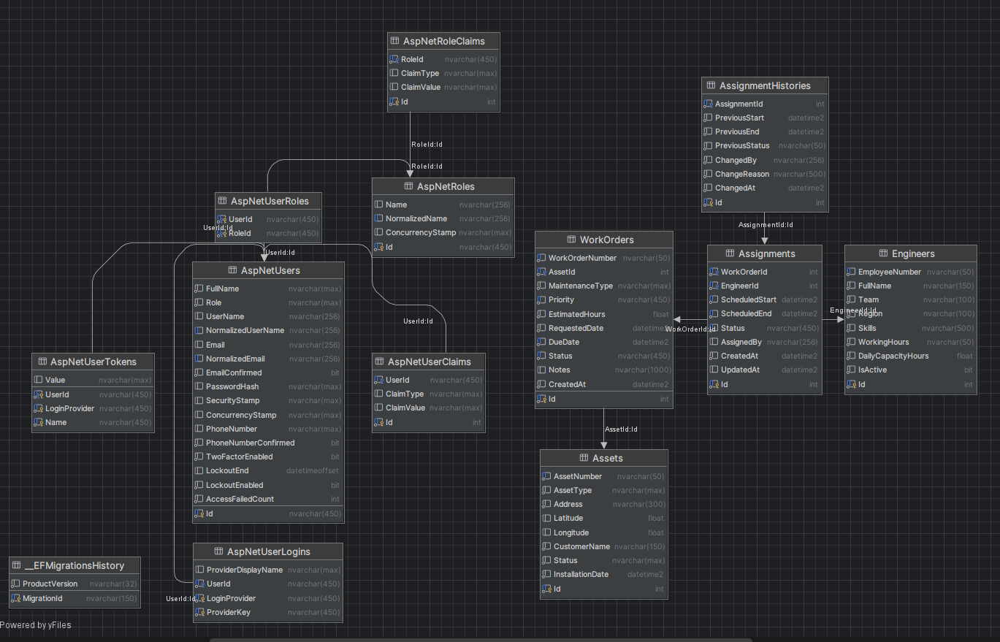

<div align="center">

# ⚙️ Azka — Maintenance Scheduling API

**A production-grade ASP.NET Core 8 REST API for scheduling field maintenance operations.**  
Engineers · Work Orders · Assets · Smart Auto-Assignment · Real-time Availability · Role-based Security

[](https://dotnet.microsoft.com)
[](https://docs.microsoft.com/ef/core/)
[](https://jwt.io)
[](https://xunit.net)
[](https://swagger.io)

</div>

---

## 📋 Table of Contents

- [Overview](#-overview)
- [Architecture](#-architecture)
- [Database Schema](#-database-schema)
- [API Endpoints](#-api-endpoints)
  - [Auth](#-auth)
  - [Engineers](#-engineers)
  - [Work Orders](#-work-orders)
  - [Assignments](#-assignments)
  - [Assets](#-assets)
  - [Dashboard](#-dashboard)
- [Role Permissions](#-role-permissions)
- [Smart Features](#-smart-features)
- [Domain Model](#-domain-model)
- [Tech Stack](#-tech-stack)
- [Getting Started](#-getting-started)
- [Testing](#-testing)

---

## 🌐 Overview

Azka is a field-maintenance scheduling backend that manages the full lifecycle of maintenance operations — from registering customer assets and creating work orders, to assigning the right engineer at the right time with automatic conflict detection and capacity enforcement.

**Core concepts:**

| Concept | Description |
|---|---|
| **Asset** | A customer-owned piece of equipment that requires maintenance |
| **Work Order** | A maintenance task raised against an asset, with priority, estimated hours, and deadline |
| **Engineer** | A field technician with a region, team, working hours, and daily capacity |
| **Assignment** | Binding an engineer to a work order for a specific scheduled time window |

---

## 🏛 Architecture

The solution follows **Clean Architecture** with strict layer separation:

```
┌─────────────────────────────────────────────────────────────┐
│                    Azka.Presentation                        │
│           Controllers · Validators · Middleware             │
├─────────────────────────────────────────────────────────────┤
│   Azka.Services (Interfaces)  │  Azka.Services.Implementation│
│   DTOs · IService contracts   │  Business logic · Caching   │
├─────────────────────────────────────────────────────────────┤
│                     Azka.Domain                             │
│          Entities · Enums · Specifications · IRepo          │
├─────────────────────────────────────────────────────────────┤
│    Azka.Persistence          │  Azka.Shared                 │
│    EF Core · UnitOfWork      │  ApiResponse · PagedResult   │
└─────────────────────────────────────────────────────────────┘
```

**Patterns used:**
- ✅ Repository + Unit of Work
- ✅ Specification Pattern (all query logic encapsulated in specs)
- ✅ CQRS-style service split (reads vs. writes)
- ✅ Global Exception Middleware (structured error responses)
- ✅ Consistent `ApiResponse<T>` envelope on every endpoint
- ✅ `PagedResult<T>` with `page` / `pageSize` on every list endpoint

---

## 🗄 Database Schema

The diagram below shows all tables generated by EF Core migrations, their columns, data types, and foreign-key relationships.



**Key relationships at a glance:**

| Relationship | Type | Description |
|---|---|---|
| `Assets` → `WorkOrders` | One-to-Many | An asset can have many work orders over its lifetime |
| `WorkOrders` → `Assignments` | One-to-Many | A work order can be assigned (and re-assigned) multiple times |
| `Engineers` → `Assignments` | One-to-Many | An engineer can hold many scheduled assignments |
| `Assignments` → `AssignmentHistories` | One-to-Many | Every reschedule / status change is appended as a history record |
| `AspNetUsers` → `AspNetUserRoles` | Many-to-Many | ASP.NET Identity role membership |
| `AspNetRoles` → `AspNetRoleClaims` | One-to-Many | Role-level claims (permissions) |

---

## 🔌 API Endpoints

### 🔐 Auth

`/api/Auth`

| Method | Endpoint | Description | Auth |
|--------|----------|-------------|------|
| `POST` | `/register` | Register a new user with role `Admin`, `Dispatcher`, or `Engineer` | Public |
| `POST` | `/login` | Authenticate and receive a JWT bearer token | Public |

**Register body:**
```json
{
  "fullName": "Saif Lotfy",
  "email": "saif@example.com",
  "password": "Pa$$W0rd",
  "role": "Engineer"
}
```

---

### 👷 Engineers

`/api/Engineers`

| Method | Endpoint | Description | Roles |
|--------|----------|-------------|-------|
| `GET` | `/` | List engineers — filter by `region`, `team`, `isActive`, `workingHours`; paginated | All |
| `GET` | `/{id}` | Get a single engineer by ID | All |
| `GET` | `/{id}/workload` | Real-time workload for a given `date` (assigned hours vs. daily capacity) | All |
| `GET` | `/available` | Engineers available for a `from`→`to` window — checks working hours, conflicts, and capacity | All |
| `POST` | `/` | Create a new engineer | Admin, Dispatcher |
| `PUT` | `/{id}` | Update engineer profile | Admin, Dispatcher |
| `DELETE` | `/{id}` | Soft-deactivate an engineer | Admin |

**Availability query example:**
```
GET /api/Engineers/available?from=2026-07-30T08:00:00&to=2026-07-30T11:00:00&region=Cairo
```

---

### 📋 Work Orders

`/api/WorkOrders`

| Method | Endpoint | Description | Roles |
|--------|----------|-------------|-------|
| `GET` | `/` | List work orders — filter by `status`, `priority`, `assetId`, `region`, `fromDate`, `toDate`; paginated | All |
| `GET` | `/{id}` | Get a single work order by ID | All |
| `POST` | `/` | Create a new work order linked to an asset | Admin, Dispatcher |
| `PATCH` | `/{id}/status` | Update work order status | All |
| `DELETE` | `/{id}` | Cancel a work order | Admin, Dispatcher |

**Work Order priorities:** `Low` · `Medium` · `High` · `Emergency`

**Work Order statuses:** `Open` → `Assigned` → `InProgress` → `Completed` / `Cancelled`

---

### 📌 Assignments

`/api/Assignments`

| Method | Endpoint | Description | Roles |
|--------|----------|-------------|-------|
| `GET` | `/` | List assignments — filter by `engineerId`, `workOrderId`, `status`, `fromDate`, `toDate`; paginated | All |
| `GET` | `/{id}` | Get a single assignment by ID | All |
| `POST` | `/` | Assign a work order to an engineer (with conflict + capacity checks) | Admin, Dispatcher |
| `POST` | `/auto-assign` | **Auto-assign** — finds the least-loaded available engineer automatically | Admin, Dispatcher |
| `PUT` | `/{id}/reschedule` | Reschedule an assignment (full history preserved) | Admin, Dispatcher |
| `PATCH` | `/{id}/status` | Update status: `InProgress`, `Completed`, `Failed` | Admin, Dispatcher, Engineer |
| `DELETE` | `/{id}` | Cancel an assignment | Admin, Dispatcher |

> **Assignment History** is recorded on every status change and reschedule — who changed it and when is always auditable.

---

### 🏭 Assets

`/api/Assets`

| Method | Endpoint | Description | Roles |
|--------|----------|-------------|-------|
| `GET` | `/` | List assets — filter by `assetType`, `status`, `customerName`, `assetNumber`; paginated | All |
| `GET` | `/{id}` | Get a single asset by ID | All |
| `POST` | `/` | Register a new asset | Admin |
| `DELETE` | `/{id}` | Remove an asset | Admin |

---

### 📊 Dashboard

`/api/Dashboard`

| Method | Endpoint | Description | Auth |
|--------|----------|-------------|------|
| `GET` | `/` | Live operational KPIs — engineers (total/available/busy/overloaded) + work orders (by status, overdue, emergency) | All |

**Response snapshot:**
```json
{
  "engineerSummary": {
    "totalEngineers": 24,
    "availableEngineers": 9,
    "busyEngineers": 13,
    "overloadedEngineers": 2,
    "inactiveEngineers": 1
  },
  "workOrderSummary": {
    "totalWorkOrders": 120,
    "openWorkOrders": 18,
    "assignedWorkOrders": 31,
    "inProgressWorkOrders": 22,
    "completedWorkOrders": 44,
    "overdueWorkOrders": 5,
    "emergencyRequests": 3,
    "cancelledWorkOrders": 2
  }
}
```

---

## 🛡 Role Permissions

```
┌───────────────────────────────────────────────────────────────────┐
│ Action                          │ Admin │ Dispatcher │ Engineer   │
├─────────────────────────────────┼───────┼────────────┼────────────┤
│ Read engineers / workorders     │  ✅   │     ✅     │    ✅      │
│ Create / update engineers       │  ✅   │     ✅     │    ❌      │
│ Deactivate engineers            │  ✅   │     ❌     │    ❌      │
│ Create / cancel work orders     │  ✅   │     ✅     │    ❌      │
│ Create / auto-assign assignments│  ✅   │     ✅     │    ❌      │
│ Update assignment status        │  ✅   │     ✅     │    ✅      │
│ Register / delete assets        │  ✅   │     ❌     │    ❌      │
│ View dashboard                  │  ✅   │     ✅     │    ✅      │
└───────────────────────────────────────────────────────────────────┘
```

---

## ✨ Smart Features

### 🤖 Auto-Assignment Engine
POST `/api/Assignments/auto-assign` picks the **least-loaded available engineer** that satisfies:
- Is in the correct region (optional filter)
- Has the required skills
- Has no scheduling conflicts in the requested time window
- Has enough remaining daily capacity to absorb the work order's estimated hours

### ⚡ In-Memory Caching
| Cache | TTL | Invalidated by |
|-------|-----|----------------|
| Engineer list (per query combo) | 5 min | Any engineer write |
| Dashboard KPIs | 2 min | Any engineer / work order / assignment write |

### 📅 Conflict & Capacity Detection
Every manual and automatic assignment validates:
1. **Schedule conflict** — no two assignments for the same engineer overlap
2. **Daily capacity** — total assigned hours on that day must not exceed `DailyCapacityHours`
3. **Working hours** — requested window must fall within the engineer's shift (e.g. `08:00-17:00`)

### 🕒 Assignment History / Audit Trail
Every reschedule and status transition is appended to `AssignmentHistory` — capturing the actor, old/new status, and timestamp.

### 🚨 Structured Error Responses
Global middleware transforms every exception into a consistent problem-details JSON:
```json
{
  "title": "Not Found",
  "status": 404,
  "detail": "Engineer with id '99' was not found.",
  "traceId": "0HNN..."
}
```

---

## 🗂 Domain Model

```
ApplicationUser
  └── (ASP.NET Identity, role: Admin | Dispatcher | Engineer)

Asset
  ├── Id, AssetNumber, CustomerName
  ├── AssetType, Status
  └── WorkOrders[]

WorkOrder
  ├── Id, Title, Description
  ├── Priority (Low | Medium | High | Emergency)
  ├── Status (Open | Assigned | InProgress | Completed | Cancelled)
  ├── EstimatedHours, Deadline
  ├── Region
  └── Asset (FK)

Engineer
  ├── Id, EmployeeNumber, FullName, Email
  ├── Team, Region, Skills
  ├── WorkingHours (e.g. "08:00-17:00")
  ├── DailyCapacityHours
  ├── IsActive
  └── Assignments[]

Assignment
  ├── Id, ScheduledStart, ScheduledEnd
  ├── Status (Scheduled | InProgress | Completed | Cancelled | Failed)
  ├── Notes, AssignedBy
  ├── Engineer (FK), WorkOrder (FK)
  └── History[]

AssignmentHistory
  ├── ChangedAt, ChangedBy
  ├── OldStatus, NewStatus
  └── Reason
```

---

## 🛠 Tech Stack

| Layer | Technology |
|-------|------------|
| Framework | ASP.NET Core 8 |
| ORM | Entity Framework Core 8 |
| Database | SQL Server |
| Auth | ASP.NET Core Identity + JWT Bearer |
| Caching | `IMemoryCache` (in-process) |
| Validation | FluentValidation |
| API Docs | Swashbuckle / Swagger UI |
| Testing | xUnit + Moq |
| Architecture | Clean Architecture · Repository · Unit of Work · Specification |

---

## 🚀 Getting Started

### Prerequisites
- [.NET 8 SDK](https://dotnet.microsoft.com/download)
- SQL Server (or LocalDB)

### 1. Clone & configure
```bash
git clone https://github.com/sefffo/Azka-Problem3.git
cd Azka-Problem3
```

Edit `Azka.Web/appsettings.json`:
```json
{
  "ConnectionStrings": {
    "DefaultConnection": "Server=.;Database=AzkaDb;Trusted_Connection=True;"
  },
  "JwtSettings": {
    "SecretKey": "your-secret-key",
    "Issuer": "Azka",
    "Audience": "AzkaClient",
    "ExpirationMinutes": 60
  }
}
```

### 2. Apply migrations & run
```bash
dotnet ef database update --project Azka.Persistence --startup-project Azka.Web
dotnet run --project Azka.Web
```

Roles (`Admin`, `Dispatcher`, `Engineer`) are **seeded automatically** on startup.

### 3. Explore
Open **Swagger UI** at `https://localhost:{port}/swagger`

Or use the included [`swagger-test-requests.http`](./swagger-test-requests.http) file with the VS Code REST Client.

---

## 🧪 Testing

```bash
dotnet test
```

The `Azka.Tests` project covers:
- ✅ Engineer availability logic (working hours, conflict, capacity)
- ✅ Assignment creation and conflict detection
- ✅ Auto-assignment selection algorithm
- ✅ Edge cases: overlapping windows, over-capacity, inactive engineers

---

<div align="center">

Built with ❤️ — Clean Architecture · .NET 8 · EF Core · JWT

</div>
